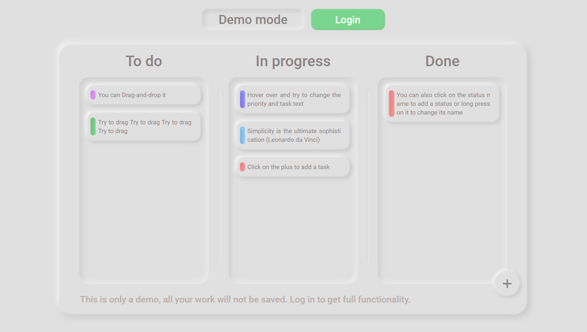
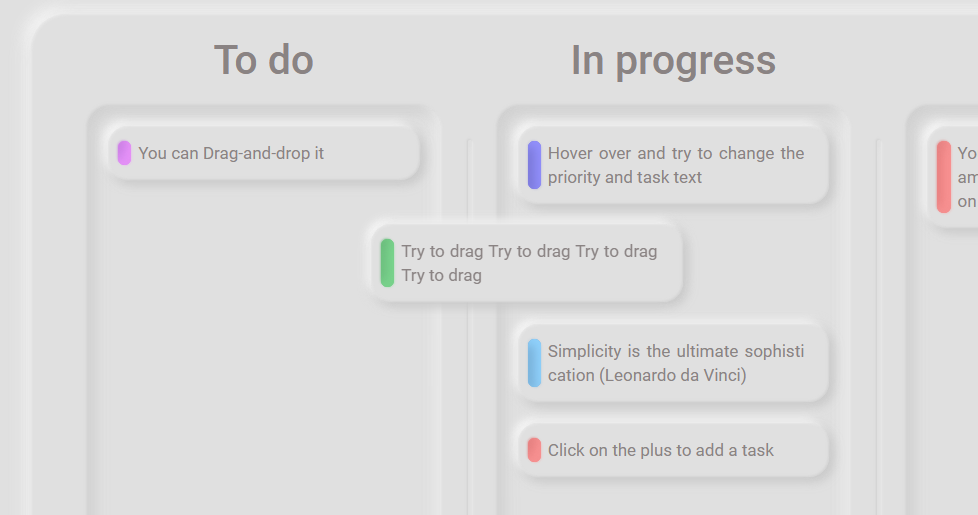
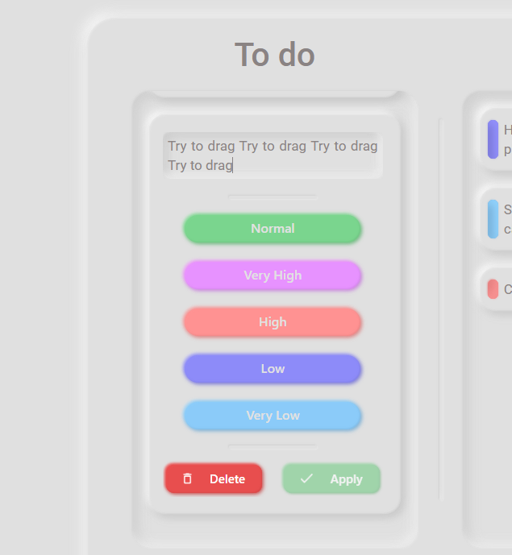
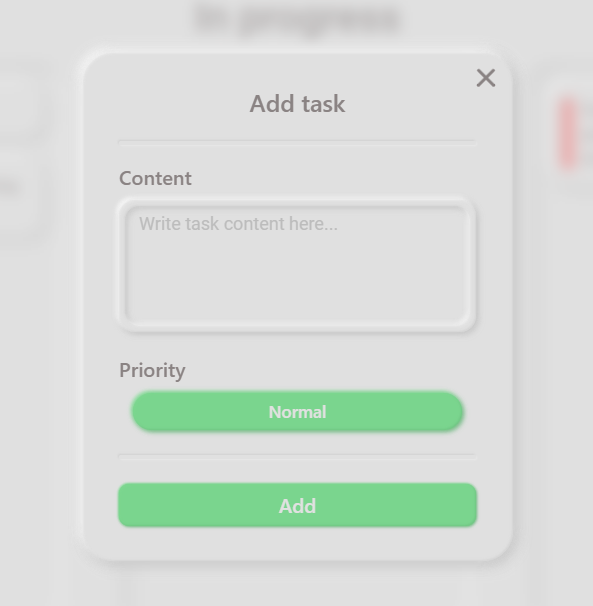
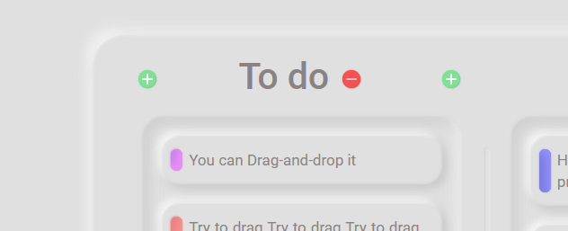
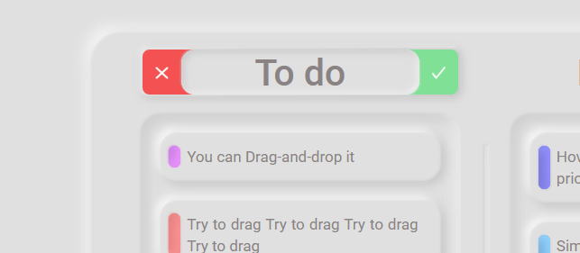
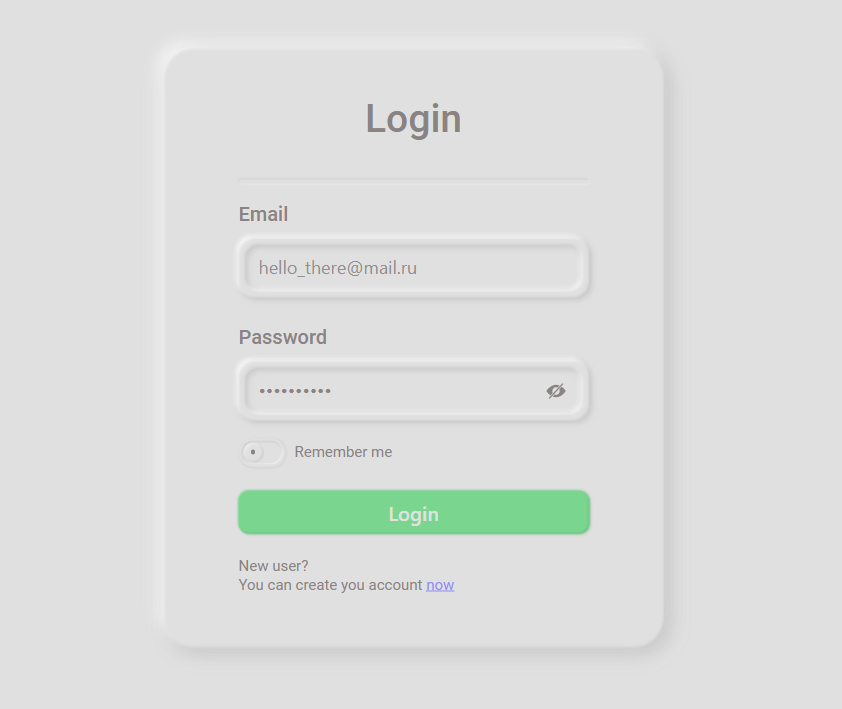
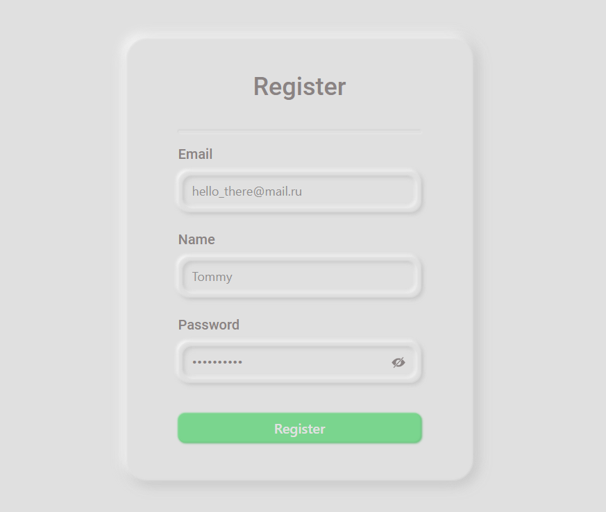
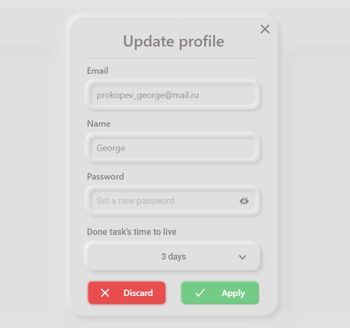

# 
To Do Desk

 

### Описание

Доска задач, где можно создавать статусы и задачи. Также на сайте есть 
возможность зарегистрироваться. Задачи можно редактировать и перетаскивать между 
статусами. [Ссылка](https://kanban-tt.gapa.space).

---
### Стек:
- ReactJS
- TypeScript
- SCSS
- Redux
- Rest API
- Redux-Saga
- React Hook Form
- Jest
- React Router v6
---
### Задачи:

Задачи можно перетаскивать между статусами.

 

Редактировать выбирая при этом приоритет.

 

Добавлять новые.

 

---
### Статусы:

Статусы можно удалять и добавлять новые. 

 

Если зажать левую кнопку мыши, то можно перейти в меню редактирования статуса.

 

---
### Можно зайти в свой аккаунт или создать новый:

 

 

---
### Зайдя в аккаунт есть возможность изменить пароль, имя пользователя и длительность жизни задач.

 

